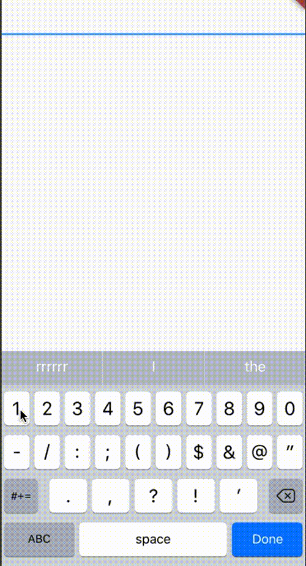

# flutter_masked_text

Masked text input for flutter.


## Alert

Hi guys!

Unfortunately, I'm not developing mobile anymore. This repo will not receive updates.

## Install

Follow this [GUIDE](https://pub.dartlang.org/packages/flutter_masked_text#-installing-tab-)

## Usage

Import the library

```dart
import 'package:flutter_masked_text/flutter_masked_text.dart';
```

## MaskedText

Create your mask controller:

```dart
var controller = new MaskedTextController(mask: '000.000.000-00');
```

Set controller to your text field:

```dart
return new MaterialApp(
    title: 'Flutter Demo',
    theme: new ThemeData(
        primarySwatch: Colors.blue,
    ),
    home: new SafeArea(
        child: new Scaffold(
            body: new Column(
                children: <Widget>[
                    new TextField(controller: controller,) // <--- here
                ],
            ),
        ),
    ),
);
```

This is the result:



### Mask Options

In mask, you can use the following characters:

-   `0`: accept numbers
-   `A`: accept letters
-   `@`: accept numbers and letters
-   `*`: accept any character

### Initial Value

To start a mask with initial value, just use `text` property on constructor:

```dart
var controller = new MaskedTextController(mask: '000-000', text: '123456');
```

### Update text programaticaly

If you want to set new text after controller initiatialization, use the `updateText` method:

```dart
var controller = new MaskedTextController(text: '', mask: '000-000');
controller.updateText('123456');

print(controller.text); //123-456
```

### Using custom translators

If you want to use your custom regex to allow values, you can pass a custom translation dictionary:

```dart
const translator = {
    '#': new RegExp(r'my regex here')
};

var controller = new MaskedTextController(mask: '####', translator: translator);
```

If you want to use default translator but override some of then, just get base from `getDefaultTranslator` and override what you want (here is a sample for obfuscated credit card):

```dart
var translator = MaskedTextController.getDefaultTranslator(); // get new instance of default translator.
translator.remove('*'); // removing wildcard translator.

var controller = new MaskedTextController(mask: '0000 **** **** 0000', translator: translator);
controller.updateText('12345678');

print(controller.text); //1234 **** **** 5678
```

### Change the mask in runtime

You can use the `updateMask` method to change the mask after the controller was created.

```dart
var cpfController = new MaskedTextController(text: '12345678901', mask: '000.000.000-00');

print(cpfController.text); //'123.456.789-01'

cpfController.updateMask('000.000.0000-0');

print(cpfController.text); //'123.456.7890-1'
```

### Hook: beforeChange [v0.7.0+]

In some cases, you will want to validate the mask value to decide if it's allowed to input or not.

It's simple: you just need to set the `beforeChange` and return `true` or `false`. If you return `true`, it will accept the new value and will try to apply the mask. Otherwhise, it will reject the new value.

The function receives two parameters:

-   `previous`: the previous text of the controller.
-   `next`: the next text that will be masked.

```dart
var controller = new MaskedTextController(mask: '(00) 0000-0000');
controller.beforeChange = (String previous, String next) {
    // my logic here

    return true;
};
```

### Hook: afterChange [v0.7.0+]

This function will be called after setted in the controller.

The function receives two parameters:

-   `previous`: the previous text of the controller.
-   `next`: the next text that will be masked.

```dart
var controller = new MaskedTextController(mask: '(00) 0000-0000');
controller.afterChange = (String previous, String next) {
    print("$previous | $next");
};
```

## Money Mask

To use money mask, create a MoneyMaskedTextController:

```dart
var controller = new MoneyMaskedTextController();

//....
new TextField(controller: controller, keyboardType: TextInputType.number)
```

### Decimal and Thousand separator

It's possible to customize `decimal` and `thousand` separators:

```dart
var controller = new MoneyMaskedTextController(decimalSeparator: '.', thousandSeparator: ',');
```

### Set value programaticaly

To set value programaticaly, use `updateValue`:

```dart
controller.updateValue(1234.0);
```

### Get double value

To get the number value from masked text, use the `numberValue` property:

```dart
double val = controller.numberValue;
```

### Using decoration symbols

You can use currency symbols if you want:

```dart
// left symbol
var controller = new MoneyMaskedTextController(leftSymbol: 'R\$ ');
controller.updateValue(123.45);

print(controller.text); //<-- R$ 123,45


// right symbol
var controller = new MoneyMaskedTextController(rightSymbol: ' US\$');
controller.updateValue(99.99);

print(controller.text); //<-- 99,99 US$


// both
var controller = new MoneyMaskedTextController(leftSymbol: 'to pay:', rightSymbol: ' US\$');
controller.updateValue(123.45);

print(controller.text); //<-- to pay: 123,45 US$
```

### hook: afterChange [v0.7.0+]

You can watch for mask and value changes. To do this, just set the `afterChange` hook.

This function receives two parameters:

-   `masked`: the masked text of the controller.
-   `raw`: the double value of the text.

```dart
var controller = new MoneyMaskedTextController();

controller.afterChange = (String masked, double raw) {
    print("$masked | $raw");
};
```

### Defining decimal places [v0.8.0+]

You can define the number of decimal places using the `precision` prop:

```dart
var controller = new MoneyMaskedTextController(precision: 3);
controller.updateValue(123.45);

print(controller.text); //<-- 123,450
```

## Using default TextEditingController

The MaskedTextController and MoneyMaskedTextController extends TextEditingController. You can use all default native methods from this class.

## Samples

You can check some code samples in this repo: [flutter-masked-text-samples](https://github.com/benhurott/flutter-masked-text-samples)

## TODO

-   [x] Custom translations
-   [x] Money Mask
-   [ ] Raw Text Widget
